<h1 align="center">🌊 Lakshita Soni 🌊</h1>

  

🚀 <strong>Machine Learning Enthusiast</strong> | <strong>AI Advocate</strong> | <strong>Student of Life</strong> 
🔭 Exploring <strong>AI for social good</strong> and <strong>machine learning</strong> in healthcare. 
🌱 Learning <strong>quant finance</strong> and <strong>AI-powered tools</strong>. 
👯 Open to collaborating on impactful <strong>AI projects</strong>. 
📫 Reach me at: <a href="mailto:lakshita0000001@gmail.com">lakshita0000001@gmail.com</a>

---

<h2 align="center">🧠 About Me</h2>

I build intelligent systems that <strong>transform lives</strong> — not just impress recruiters. 
From <strong>predicting critical illnesses</strong> to <strong>engineering AI for the visually impaired</strong>, my work attacks real-world challenges head-on. 
I don't <em>chase trends</em> — I <strong>forge new paths</strong> others eventually follow. 
Rooted in <strong>Python, C++, machine learning</strong>, and <strong>deep problem-solving</strong>, I'm expanding into <strong>quant finance</strong> and <strong>advanced DSA</strong> to sharpen my edge.

---

<h2 align="center">🎯 My Mission</h2>

To engineer AI-driven solutions that are <strong>essential</strong>, not optional.  
🚀 <strong>If you’re building the future, we’re already aligned.</strong>

---

<h2 align="center">💻 Tech Stack</h2>

<h3 align="center">Languages</h3>

  

<h3 align="center">Tools & Frameworks</h3>

  

<h3 align="center">Machine Learning Libraries</h3>

  

---

<h2 align="center">🔥 Featured Projects</h2>

<h3 align="center">🚑 AI-Powered Diagnostic Assistant</h3>

Gemini Flash 2.0 -based diagnostic system (heart disease, breast cancer). 
<strong>Tech Stack:</strong> Python, Scikit-learn, Flask, TensorFlow. 
<a href="https://huggingface.co/spaces/laksss/Diagnostic-Assistant">🔗 Try it here</a>

<h3 align="center">🧭 AI Assistant for Visually Impaired (🚀 Coming Soon)</h3>

Navigation, currency recognition, and transport guidance. 
<strong>Tech Stack:</strong> YOLO, Pose Estimation, TTS.

<h3 align="center">📊 Budget Calculator (Tax Estimator 2025)</h3>

Compare new vs old Indian tax regimes. 
<strong>Tech Stack:</strong> Vanilla JavaScript, HTML, CSS. 
<a href="https://budget-calculator-alpha-eight.vercel.app/">🔗 Try it here</a>

<h3 align="center">⚡ 30-Day Data Science Sprint</h3>

Mini-projects across ML and Data Science: Wine classification, Market Basket Analysis, and more.

---

<h2 align="center">📈 GitHub Insights</h2>

  
  

---

<h2 align="center">😭 Snake eating my contributions 🐍</h2>

  

---

<h2 align="center">🌍 Let's Connect</h2>

<a href="https://www.linkedin.com/in/lakshita-soni-b3268b2a5/">LinkedIn</a> | 
<a href="https://github.com/lakshitaa4">GitHub</a> | 
<a href="mailto:lakshita0000001@gmail.com">Email</a>

---

<h2 align="center">📜 License</h2>

Licensed under the <strong>MIT License</strong> — see the <a href="LICENSE">LICENSE</a> file for details.

